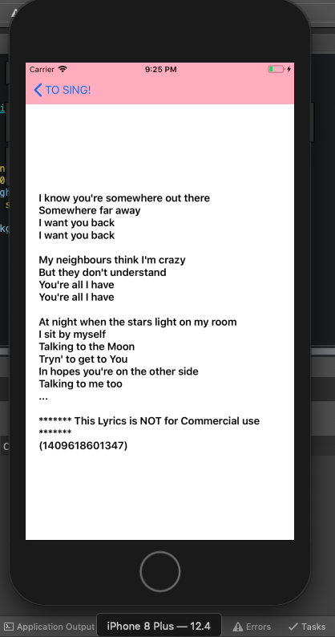
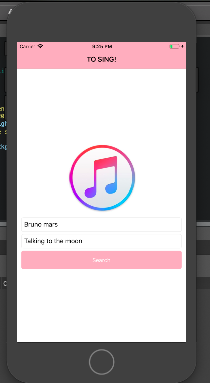
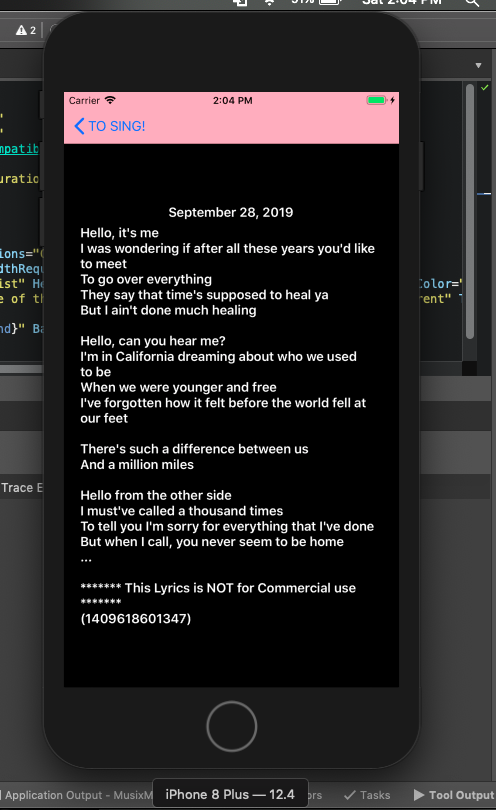
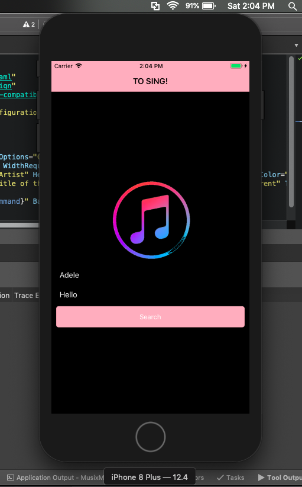

# ApiServicePractice
This is the preview of the practice

Musixmatch lyrics API is a robust service that permits you to search and retrieve lyrics in the simplest possible way. It just works.

Include millions of licensed lyrics on your website or in your application legally.

The fastest, most powerful and legal way to display lyrics on your website or in your application."
I choose the method Music Lyrics you can search your music lyrics by Artist and Name of the song"

Xamls Tips Elected:

1. Static Properties
2. Attached Properties
3. Generics Styles
4. Native Properties -> Save area layout
5. Simplfy namespace

  
 

  

  

  

  

